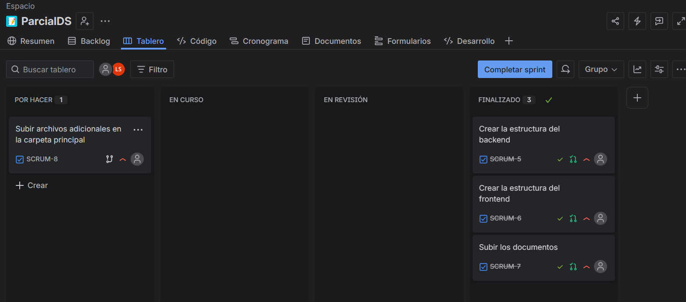

# Examen Parcial Desarrollo de Software

Luis Andre Trujillo Serva 20220428D

## Descripción del proyecto

Este proyecto implementa un sistema de registro de baches en vía pública usando:
- Backend con **FastAPI**.
- Base de datos **SQLite** local por defecto, con PostgreSQL opcional.
- Frontend simple en **HTML/CSS/JavaScript**.
- API con soporte para subir archivos multimedia: **imágenes, video y audio** , pero para esta prueba adjuntare evidencia de imágenes.

## Estructura del repositorio

- `backend/`: código fuente del backend con FastAPI.
- `frontend/`: cliente web que consume la API.
- `docs/`: documentación de requisitos, casos de uso, arquitectura, pruebas y flujo GitFlow.
- `run.ps1`: script de automatización para ejecutar backend y frontend localmente.

## Cómo ejecutar localmente

### 1. Ejecutar todo automático

Desde la raíz del proyecto:

```powershell
cd Parcial_DS.\run.ps1
```

Ese script hace:
- crear o usar el entorno virtual `backend/.venv`
- instalar dependencias
- copiar `backend/.env.example` a `backend/.env` si no existe
- iniciar el backend FastAPI
- iniciar el frontend estático
- abrir `http://localhost:5500` en el navegador

### 2. Base de datos local

El proyecto usa SQLite local de forma predeterminada.

- El archivo de base de datos se crea en: `backend/incidents.db`
- La aplicación registra exclusivamente baches.

### 3. Verificar servicios

- API interactiva: `http://localhost:8000/docs`
- Frontend: `http://localhost:5500`

Si ya ejecutó `run.ps1`, no es necesario iniciar nada más. Para ejecutar solo el backend:

```powershell
cd Parcial_DS\backend uvicorn app.main:app --reload --host 0.0.0.0 --port 8000
```

### 4. Abrir la API

- Documentación interactiva: `http://localhost:8000/docs`
- Ruta principal de incidencias: `http://localhost:8000/`

### 5. Iniciar el frontend

Desde la carpeta `frontend`:

```powershell
cd ..\frontend
python -m http.server 5500
```

Abra en el navegador:

- `http://localhost:5500`

## Rutas principales

- `GET /`: lista incidencias.
- `GET /incidents/{id}`: consulta una incidencia.
- `POST /incidents`: registra una incidencia.
- `PUT /incidents/{id}`: actualiza una incidencia.
- `DELETE /incidents/{id}`: elimina una incidencia.
- `POST /media/upload`: sube un archivo multimedia.

Para realizar dichas solicitudes CRUD , se especifica algunos ejemplos en `docs/pruebas.md`.

## Documentación generada

- `docs/requisitos_software.md`
- `docs/casos_de_uso.md`
- `docs/arquitectura.md`
- `docs/flujo_gitflow.md`
- `docs/casos_prueba.md`

Además visualizamos el progreso de las tareas creadas en el Jira.


