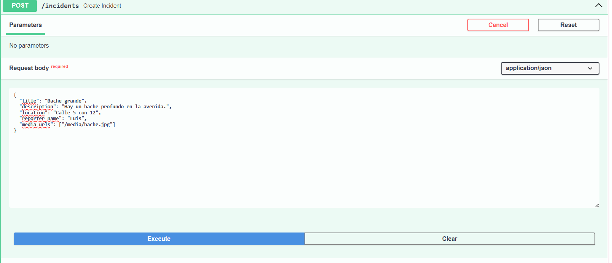
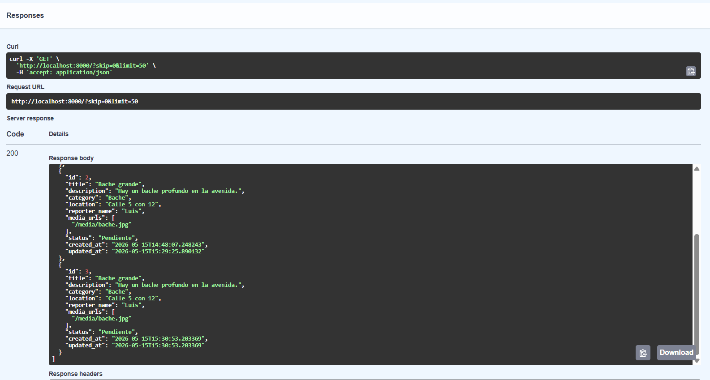
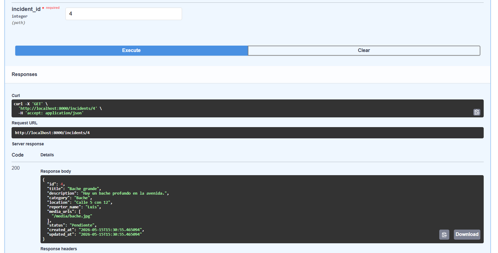
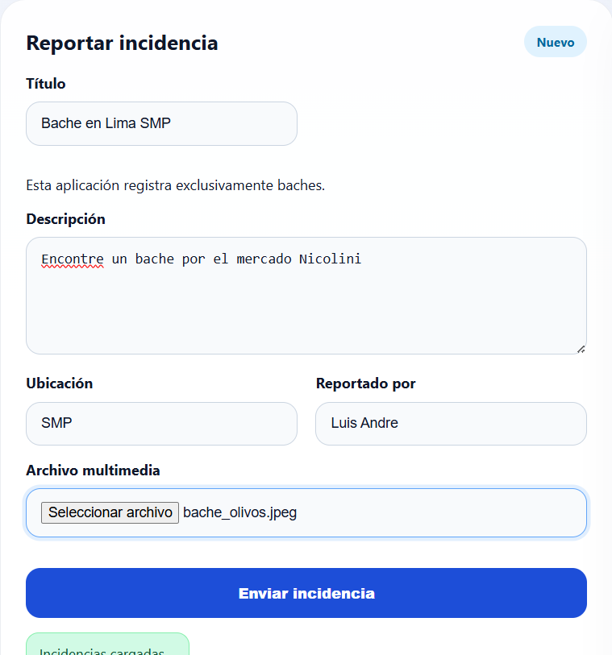
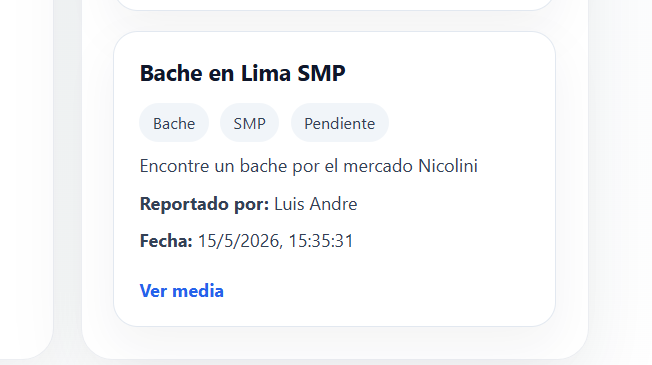
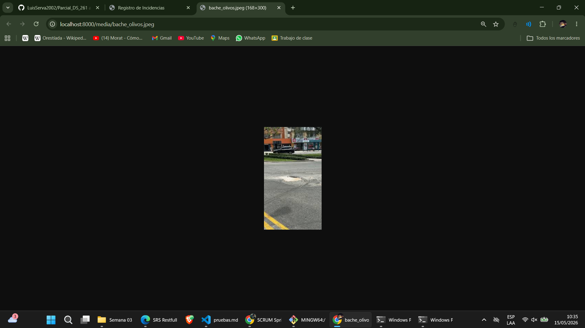

# Casos de Prueba

## Objetivo
Definir pruebas para validar el correcto funcionamiento del sistema de registro de baches y del backend FastAPI.

## Alcance
Pruebas que cubren las rutas principales de la API, la gestión de incidencias y la carga de archivos multimedia.

## Casos de prueba

### 1. Crear un bache
- Ruta: `POST /incidents`
- Datos:
  - `title`: "Bache peligroso"
  - `description`: "Un bache profundo en la calle principal"
  - `location`: "Av. Central 123"
  - `reporter_name`: "Luis"
  - `media_urls`: ["/media/bache.jpg"]
- Resultado esperado:
  - Código HTTP `201`
  - Respuesta JSON con `category` = "Bache"
  - El registro contiene `title`, `description`, `location`, `reporter_name` y `media_urls`

### 2. Listar incidencias
- Ruta: `GET /`
- Resultado esperado:
  - Código HTTP `200`
  - Lista de incidencias no vacía después de crear un registro
  - Cada incidencia incluye `id`, `title`, `category`, `location`, `reporter_name`, `status`, `created_at`

### 3. Consultar incidencia por ID
- Ruta: `GET /incidents/{incident_id}`
- Datos:
  - ID de una incidencia existente
- Resultado esperado:
  - Código HTTP `200`
  - Detalle completo de la incidencia solicitada
  - `category` = "Bache"

### 4. Actualizar una incidencia
- Ruta: `PUT /incidents/{incident_id}`
- Datos:
  - `status`: "Resuelto"
  - `description`: "Se reparó el bache"
- Resultado esperado:
  - Código HTTP `200`
  - El campo `status` se actualiza a "Resuelto"
  - La incidencia conserva `category` = "Bache"

### 5. Eliminar una incidencia
- Ruta: `DELETE /incidents/{incident_id}`
- Resultado esperado:
  - Código HTTP `204`
  - El registro ya no aparece en `GET /`

### 6. Subir archivo multimedia
- Ruta: `POST /media/upload`
- Datos:
  - Archivo válido de imagen, audio o video
- Resultado esperado:
  - Código HTTP `200`
  - Respuesta JSON con `filename` y `url`
  - El archivo queda accesible desde la ruta `url`

## Pruebas técnicas

### 1. Verificación manual de frontend
- Abrir `http://localhost:5500`
- Registrar un bache y verificar que aparece en la lista
- Verificar que la vista principal muestra el estado correcto

## Evidencias
### Flujo completo con evidencias
1. Preparar el entorno
   - Asegúrese de tener el backend ejecutando en `http://localhost:8000`.
   - Abra la documentación interactiva en `http://localhost:8000/docs`.
2. Crear una incidencia (`POST /incidents`)
   - Realice la prueba usando un payload válido.
   - Verifique respuesta `201`.
   - Ejemplo de evidencia:
     
3. Consultar todas las incidencias (`GET /`)
   - Verifique que el nuevo registro aparece en la lista.
   - Ejemplo de evidencia:
     
4. Consultar una incidencia por ID (`GET /incidents/{incident_id}`)
   - Ingrese el ID del registro creado.
   - Ejemplo de evidencia:
     
5. Actualizar una incidencia (`PUT /incidents/{incident_id}`)
   - Cambie el estado a `Resuelto`.
   - Ejemplo de evidencia:
     
   - Verifique el cambio en la lista.
   - Ejemplo de evidencia:
     
6. Eliminar una incidencia (`DELETE /incidents/{incident_id}`)
   - Elimine el registro creado.
   - Ejemplo de evidencia:
     
7. Frontend.
    
    
    

    
## Notas
- Todas las pruebas asumen que la categoría es fija en `Bache`.
- La base de datos predeterminada es SQLite local.
- Las pruebas deben ejecutarse con el backend activo en `http://localhost:8000`.
