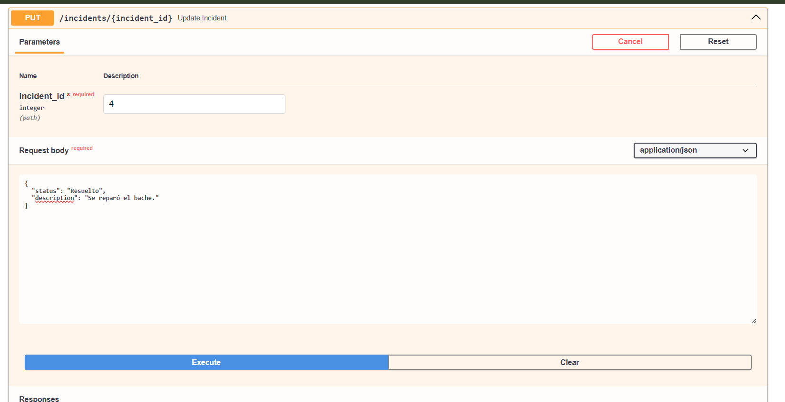
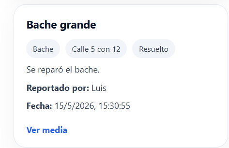
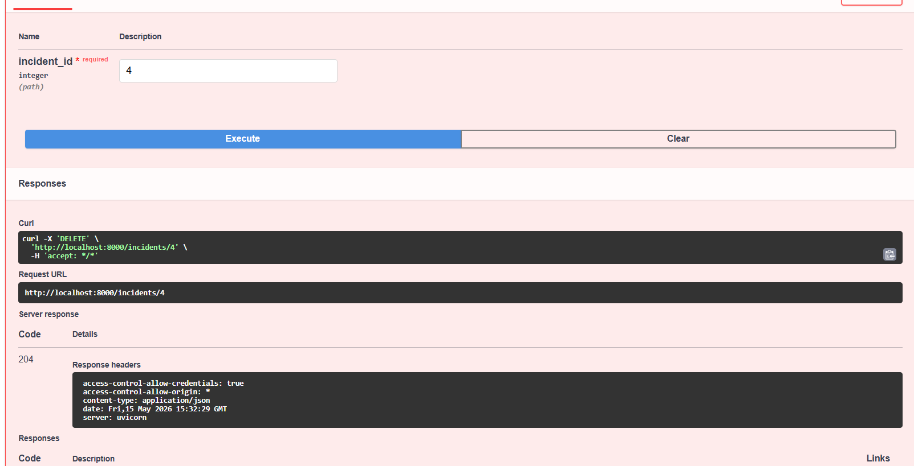

# Informe del examen parcial

### 1. Preparar el entorno
- Asegúrese de tener el backend ejecutando en `http://localhost:8000`.
- Abra la documentación interactiva en `http://localhost:8000/docs`.

### 2. Crear una incidencia (`POST /incidents`)

Crearemos una incidencia que se almacenara con un **ID 4**.

### 3. Consultar todas las incidencias (`GET /`)

### 4. Consultar una incidencia por ID (`GET /incidents/

En este caso eligiremos el incidente 4.

### 5. Actualizar una incidencia (`PUT /incidents/

Además en la intefaz principal verificamos que paso de pendiente a resuelto.

### 6. Eliminar una incidencia (`DELETE /incidents/{incident_id}`)

Eliminamos este incidente (incidente 4).

